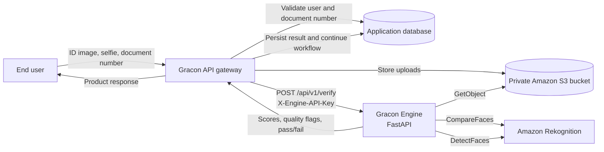
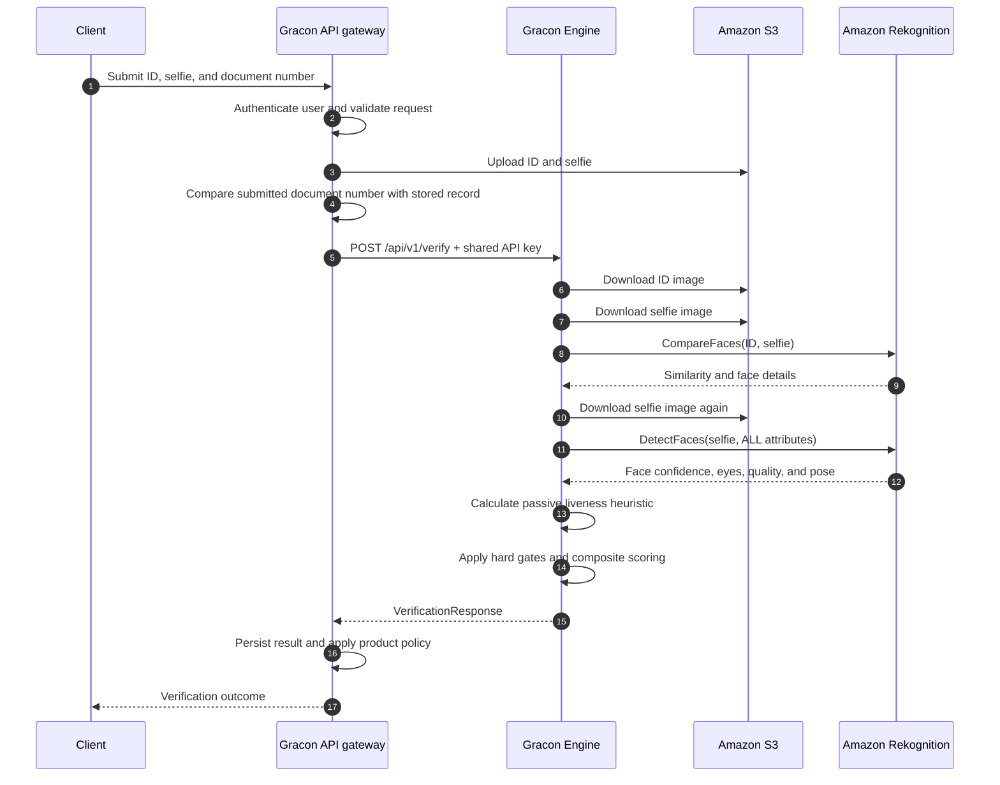
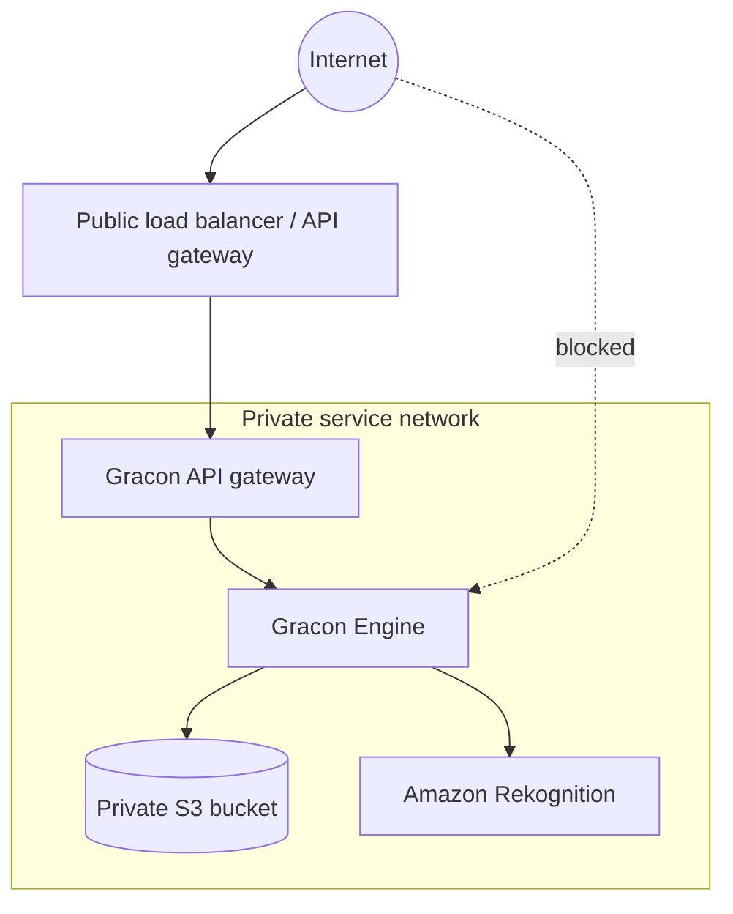

<div align="center">

# Gracon Engine

### Internal identity-verification scoring service for the Gracon platform

[](https://www.python.org/)
[](https://fastapi.tiangolo.com/)
[](https://aws.amazon.com/rekognition/)
[](https://www.docker.com/)
[](#security-boundary)

Gracon Engine is a focused FastAPI microservice that evaluates identity-verification evidence supplied by the Gracon API gateway. It compares a government-ID portrait with a selfie, derives a passive selfie-quality/liveness heuristic, combines those signals with a document-number match, and returns a structured pass/fail decision.

[Overview](#overview) · [Architecture](#architecture) · [API](#api-reference) · [Setup](#getting-started) · [Deployment](#deployment) · [Security](#security-and-privacy)

</div>

> [!IMPORTANT]
> **This service is intended to run behind a trusted API gateway on a private network.** It should not be exposed directly to browsers or the public internet.

> [!CAUTION]
> The current “liveness” check is a **single-image heuristic built from Amazon Rekognition `DetectFaces` attributes**. It is not AWS Face Liveness, does not analyze a video challenge, and should not be treated as strong spoof or presentation-attack detection. See [Liveness implementation](#liveness-implementation) and [Production hardening](#production-hardening-priorities).

---

## Table of contents

- [Overview](#overview)
- [What the engine does](#what-the-engine-does)
- [What the engine does not do](#what-the-engine-does-not-do)
- [Key features](#key-features)
- [Architecture](#architecture)
- [Verification workflow](#verification-workflow)
- [Scoring model](#scoring-model)
- [Liveness implementation](#liveness-implementation)
- [Technology stack](#technology-stack)
- [Project structure](#project-structure)
- [API reference](#api-reference)
- [Getting started](#getting-started)
- [AWS configuration](#aws-configuration)
- [Running with Docker](#running-with-docker)
- [Deployment](#deployment)
- [Security and privacy](#security-and-privacy)
- [Observability and operations](#observability-and-operations)
- [Testing](#testing)
- [Known implementation notes](#known-implementation-notes)
- [Production hardening priorities](#production-hardening-priorities)
- [Troubleshooting](#troubleshooting)
- [Contributing](#contributing)
- [License](#license)

---

## Overview

Gracon Engine isolates biometric image processing and verification scoring from the rest of the Gracon application. The surrounding gateway remains responsible for users, authorization, persistence, encrypted identity data, uploads, rate limiting, and the final product workflow.

For each verification request, the engine receives:

- an Amazon S3 key for the ID-card image;
- an Amazon S3 key for the selfie image;
- a UUID identifying the user for request correlation;
- a boolean indicating whether the submitted document number matched the gateway’s stored record.

It then:

1. downloads the two images from the configured S3 bucket;
2. compares the ID portrait with the selfie using Amazon Rekognition `CompareFaces`;
3. downloads and analyzes the selfie with `DetectFaces`;
4. derives a weighted passive “liveness” score from facial and image attributes;
5. applies hard gates and calculates a composite score;
6. returns scores, image-quality labels, a pass/fail decision, and an actionable failure reason.

The service is deliberately stateless. It does not define a database, create user records, or persist verification results.

### Intended caller

The code and request model are designed for a trusted **NestJS API gateway**. That gateway should authenticate the end user, validate ownership of the referenced images, calculate `document_match`, call this service with the shared engine key, and store the returned result.

---

## What the engine does

| Responsibility | Implementation |
|---|---|
| Face comparison | Amazon Rekognition `CompareFaces` using the ID image as source and selfie as target |
| Selfie analysis | Amazon Rekognition `DetectFaces` with all available face attributes |
| Passive heuristic | Weighted score based on face confidence, eyes-open confidence, sharpness, brightness, and pose |
| Verification scoring | 50% face similarity, 30% passive liveness score, 20% document match |
| Image-quality feedback | Returns `good`, `blurry`, `too_dark`, or `no_face` labels where applicable |
| Service authentication | Shared secret supplied in the `X-Engine-API-Key` header |
| AWS health probe | Calls Rekognition `ListCollections` from the health endpoint |
| Error normalization | Converts validation, AWS, and unexpected failures into safe HTTP responses |

## What the engine does not do

The engine intentionally does **not**:

- authenticate public users;
- authorize access to S3 object keys;
- upload identity images;
- query or update a database;
- compare document numbers itself;
- OCR or validate document authenticity;
- check expiration dates or government registries;
- perform AWS Face Liveness video sessions;
- make legal or regulatory identity decisions by itself;
- retain image files after a request;
- provide a public client SDK.

These boundaries are important. A successful engine score is one input to a broader identity-verification process, not proof of identity on its own.

---

## Key features

### Focused internal API

The API surface is intentionally small: one verification endpoint and one health endpoint. This makes the service easier to isolate, audit, deploy, and scale independently.

### Structured scoring output

The response exposes the contributing signals rather than returning only a boolean. The gateway can therefore store the full decision context and apply additional business policy if needed.

### Actionable failures

When verification fails, the engine returns a human-readable reason covering common cases such as:

- document-number mismatch;
- no face detected on the ID image;
- no face detected in the selfie;
- weak passive liveness score;
- low overall composite score.

### Defensive API-key comparison

The engine verifies the shared secret with a constant-time comparison and distinguishes missing credentials from invalid credentials.

### Controlled API documentation

Swagger UI and ReDoc are enabled only when `APP_ENV=development`. Production deployments avoid exposing interactive API documentation by default.

### Container-ready runtime

The included Dockerfile builds a slim Python 3.12 image, creates a non-root runtime user, exposes port `8000`, and starts Uvicorn with two workers.

---

## Architecture



### Security boundary

The trust boundary should be enforced at multiple layers:

1. **Network:** deploy the engine on a private service network, VPC, internal ingress, or equivalent platform-to-platform path.
2. **Application:** require `X-Engine-API-Key` on verification requests.
3. **Gateway:** authenticate the end user and confirm that supplied S3 keys belong to that user and verification attempt.
4. **AWS:** grant the engine only the S3 and Rekognition permissions it needs.
5. **Storage:** encrypt uploads and remove them through an aggressive lifecycle policy after the verification window.

The shared API key is a secondary control; it should not be the only barrier protecting a biometric-processing endpoint.

---

## Verification workflow



> [!NOTE]
> The current implementation executes face comparison and selfie analysis **sequentially**. Although an endpoint description mentions parallel processing, the code awaits neither task concurrently and uses synchronous boto3 operations.

---

## Scoring model

When the required hard gates pass, the engine calculates:

```text
composite = (face similarity × 0.50)
          + (liveness heuristic × 0.30)
          + (document match score × 0.20)
```

The document score is binary:

```text
100 when document_match = true
  0 when document_match = false
```

Therefore, a matched document contributes exactly `20` points to the normal composite calculation.

### Signal weights

| Signal | Range | Weight | Source |
|---|---:|---:|---|
| Face similarity | 0–100 | 50% | Rekognition `CompareFaces` |
| Passive liveness heuristic | 0–100 | 30% | Locally weighted `DetectFaces` attributes |
| Document match | 0 or 100 | 20% | Supplied by the API gateway |

### Decision order

The scorer evaluates rules in this order:

1. **Document mismatch:** immediate failure with composite score `0`.
2. **No face in ID image:** immediate failure with composite score `0`.
3. **No face in selfie:** immediate failure with composite score `0`.
4. **Liveness below `LIVENESS_THRESHOLD`:** immediate failure before the full composite calculation.
5. **Normal composite:** calculate the weighted score and compare it with `COMPOSITE_PASS_THRESHOLD`.

With the example configuration:

| Setting | Default example | Current behavior |
|---|---:|---|
| `FACE_SIMILARITY_THRESHOLD` | `70.0` | Loaded by configuration but **not currently enforced as a direct hard gate** |
| `LIVENESS_THRESHOLD` | `70.0` | Enforced before the normal composite calculation |
| `COMPOSITE_PASS_THRESHOLD` | `80.0` | Final pass threshold after all prior gates |

> [!WARNING]
> Thresholds are product-risk decisions. Calibrate them against representative, consented test data and monitor false-accept and false-reject rates. Do not copy example values into a high-risk production workflow without validation.

### Worked example

Given:

```text
face_similarity     = 88
liveness_confidence = 82
document_match      = true
```

The normal composite is:

```text
(88 × 0.50) + (82 × 0.30) + (100 × 0.20)
= 44 + 24.6 + 20
= 88.6
```

With `COMPOSITE_PASS_THRESHOLD=80`, this request passes, provided all earlier gates also passed.

---

## Liveness implementation

The module named `liveness.py` currently performs **passive, single-image analysis**:

1. download the selfie from S3;
2. call Rekognition `DetectFaces` with `Attributes=["ALL"]`;
3. select the detected face with the highest face-detection confidence;
4. calculate a local weighted score;
5. compare that score with `LIVENESS_THRESHOLD`.

### Heuristic composition

| Heuristic signal | Weight | Interpretation |
|---|---:|---|
| Face detection confidence | 25% | How confidently Rekognition detected a face |
| Eyes-open confidence/value | 25% | Penalizes a detected closed-eye state |
| Image sharpness | 20% | Rewards a clear selfie |
| Image brightness | 15% | Rewards brightness closer to the midpoint |
| Face pose | 15% | Rewards lower yaw, pitch, and roll deviations |

This is useful as a **capture-quality and plausibility signal**, but it is not a robust liveness system. A high-quality photograph or replay may satisfy some or all of these attributes.

### Recommended terminology

Until a true presentation-attack-detection flow is implemented, consider naming this output one of the following in downstream systems:

- `selfie_quality_score`;
- `passive_capture_score`;
- `face_plausibility_score`.

Keeping the current name may imply a stronger guarantee than the implementation provides.

### Upgrading to AWS Face Liveness

A production upgrade would typically require:

- a client-side Face Liveness session and guided video selfie;
- server endpoints to create and retrieve liveness sessions;
- AWS Face Liveness SDK integration in the supported client;
- session ownership, expiration, replay, and rate-limit controls;
- confidence-threshold calibration;
- user consent, accessibility handling, fallback paths, and human review.

AWS recommends treating Face Liveness as one signal within a risk-based verification workflow rather than as a standalone identity decision.

---

## Technology stack

| Layer | Technology | Purpose |
|---|---|---|
| Language | Python 3.12 | Service implementation and container runtime |
| Web framework | FastAPI | Routing, dependency injection, validation, and OpenAPI |
| Validation/settings | Pydantic 2 + pydantic-settings | Typed request/response models and environment configuration |
| ASGI server | Uvicorn | Local and container runtime |
| AWS SDK | boto3 / botocore | S3 object retrieval and Rekognition calls |
| Cloud storage | Amazon S3 | Temporary identity-image storage |
| Image analysis | Amazon Rekognition | Face comparison and face-attribute detection |
| Containerization | Docker | Reproducible deployment |
| Authentication | Shared API key | Gateway-to-engine request authentication |

---

## Project structure

```text
gracon-engine/
├── agents/                         # Repository guidance for specialized work
├── app/
│   ├── api/
│   │   └── v1/
│   │       ├── health.py           # AWS-aware health endpoint
│   │       ├── router.py           # /api/v1 router composition
│   │       └── verification.py     # Main verification endpoint
│   ├── core/
│   │   ├── config.py               # Environment-backed settings
│   │   ├── exceptions.py           # Safe exception handlers
│   │   ├── logging.py              # Console logging configuration
│   │   └── security.py             # X-Engine-API-Key validation
│   ├── models/
│   │   ├── requests.py             # VerificationRequest
│   │   └── responses.py            # Health and verification responses
│   └── services/
│       ├── rekognition/
│       │   ├── client.py            # Cached S3/Rekognition clients
│       │   ├── face_comparison.py   # S3 download, CompareFaces, quality flags
│       │   └── liveness.py          # DetectFaces-based passive heuristic
│       └── scoring.py               # Gates, weights, and failure reasons
├── .dockerignore
├── .env.example
├── .gitignore
├── Dockerfile
├── main.py                         # FastAPI application entry point
├── requirements.txt
└── README.md
```

---

## API reference

### Base path

```text
/api/v1
```

### Authentication

`POST /api/v1/verify` requires this header:

```http
X-Engine-API-Key: <ENGINE_API_KEY>
```

The health endpoint intentionally does not require an API key so that internal load balancers and monitoring systems can probe it.

### `GET /api/v1/health`

Checks whether the service is running and whether the configured Rekognition client can call `ListCollections`.

#### Request

```bash
curl http://localhost:8000/api/v1/health
```

#### Healthy response

```json
{
  "status": "ok",
  "environment": "development",
  "aws_connected": true
}
```

#### Degraded response

```json
{
  "status": "degraded",
  "environment": "production",
  "aws_connected": false
}
```

A degraded response means the process answered but the AWS probe failed. Causes may include missing credentials, denied `rekognition:ListCollections`, network/DNS failure, an invalid region, or an AWS service issue.

> [!NOTE]
> The endpoint still returns its response model when AWS is unavailable. Configure your platform’s readiness policy according to whether `status="degraded"` should remove an instance from service.

---

### `POST /api/v1/verify`

Runs face comparison, passive selfie analysis, and composite scoring.

#### Headers

```http
Content-Type: application/json
X-Engine-API-Key: <ENGINE_API_KEY>
```

#### Request body

```json
{
  "id_image_key": "verification/user-id/attempt-id/id-card.jpg",
  "selfie_image_key": "verification/user-id/attempt-id/selfie.jpg",
  "user_id": "550e8400-e29b-41d4-a716-446655440000",
  "document_match": true
}
```

| Field | Type | Required | Constraints | Description |
|---|---|---:|---|---|
| `id_image_key` | string | Yes | 1–512 characters | S3 object key for the ID-card image |
| `selfie_image_key` | string | Yes | 1–512 characters | S3 object key for the selfie image |
| `user_id` | string | Yes | Exactly 36 characters | Correlation identifier, expected to be a UUID string |
| `document_match` | boolean | Yes | `true` or `false` | Result calculated by the trusted gateway |

#### Example request

```bash
curl --request POST \
  --url http://localhost:8000/api/v1/verify \
  --header 'Content-Type: application/json' \
  --header "X-Engine-API-Key: ${ENGINE_API_KEY}" \
  --data '{
    "id_image_key": "verification/550e8400/id-card.jpg",
    "selfie_image_key": "verification/550e8400/selfie.jpg",
    "user_id": "550e8400-e29b-41d4-a716-446655440000",
    "document_match": true
  }'
```

#### Successful verification response

```json
{
  "passed": true,
  "scores": {
    "face_similarity": 88.32,
    "liveness_confidence": 82.14,
    "document_match": true,
    "composite_score": 88.8
  },
  "fail_reason": null,
  "id_image_quality": "good",
  "selfie_quality": "good"
}
```

#### Failed verification response

```json
{
  "passed": false,
  "scores": {
    "face_similarity": 0.0,
    "liveness_confidence": 78.4,
    "document_match": true,
    "composite_score": 0.0
  },
  "fail_reason": "No face could be detected in your ID card photo. Please ensure your ID card is clearly visible and well-lit. Image quality: no_face",
  "id_image_quality": "no_face",
  "selfie_quality": "good"
}
```

### HTTP status behavior

| Status | Meaning |
|---:|---|
| `200` | Request was processed; inspect `passed` for the verification decision |
| `401` | `X-Engine-API-Key` was not supplied |
| `403` | The supplied engine API key was invalid |
| `422` | Request validation failed |
| `503` | An AWS client error reached the centralized handler |
| `500` | An unexpected internal error occurred |

A verification decision of `passed=false` is normally a valid `200` response, not a transport error.

### Development documentation

When `APP_ENV=development`:

- Swagger UI: `http://localhost:8000/docs`
- ReDoc: `http://localhost:8000/redoc`
- OpenAPI schema: `http://localhost:8000/openapi.json`

These documentation routes are disabled by the application in non-development environments.

---

## Getting started

### Prerequisites

Install or provision:

- Python 3.12;
- `pip` and `venv`;
- an AWS account;
- a private S3 bucket containing test images;
- AWS credentials with the permissions described below;
- optional: Docker 24+.

### 1. Clone the repository

```bash
git clone https://github.com/kajugadaniels/gracon-engine.git
cd gracon-engine
```

### 2. Create a virtual environment

#### macOS or Linux

```bash
python3.12 -m venv .venv
source .venv/bin/activate
```

#### Windows PowerShell

```powershell
py -3.12 -m venv .venv
.venv\Scripts\Activate.ps1
```

### 3. Install dependencies

```bash
python -m pip install --upgrade pip
pip install -r requirements.txt
```

### 4. Create the environment file

```bash
cp .env.example .env
```

On Windows PowerShell:

```powershell
Copy-Item .env.example .env
```

### 5. Generate the internal API key

```bash
python -c "import secrets; print(secrets.token_hex(32))"
```

Use the output as `ENGINE_API_KEY` in this service and in the trusted gateway’s secret configuration.

### 6. Configure environment variables

```dotenv
APP_ENV=development
APP_PORT=8000

ENGINE_API_KEY=replace_with_a_64_character_hex_secret

AWS_REGION=us-east-1
AWS_ACCESS_KEY_ID=replace_me
AWS_SECRET_ACCESS_KEY=replace_me
AWS_S3_BUCKET_NAME=your-private-verification-bucket

FACE_SIMILARITY_THRESHOLD=70.0
LIVENESS_THRESHOLD=70.0
COMPOSITE_PASS_THRESHOLD=80.0
```

### 7. Start the development server

```bash
uvicorn main:app --host 0.0.0.0 --port 8000 --reload
```

Alternatively:

```bash
python main.py
```

### 8. Check service health

```bash
curl http://localhost:8000/api/v1/health
```

### Environment variables

| Variable | Required | Example | Description |
|---|---:|---|---|
| `APP_ENV` | Yes | `development` | Enables development logging and API docs when set to `development` |
| `APP_PORT` | Yes | `8000` | Port used by the local `python main.py` entry point |
| `ENGINE_API_KEY` | Yes | random 64-character hex | Shared gateway-to-engine credential |
| `AWS_REGION` | Yes | `us-east-1` | Region used to create both S3 and Rekognition clients |
| `AWS_ACCESS_KEY_ID` | Yes in current config | — | AWS access-key ID |
| `AWS_SECRET_ACCESS_KEY` | Yes in current config | — | AWS secret access key |
| `AWS_S3_BUCKET_NAME` | Yes | `gracon-verification-private` | Bucket from which image bytes are read |
| `FACE_SIMILARITY_THRESHOLD` | Yes | `70.0` | Present in settings but not currently applied as a direct scorer gate |
| `LIVENESS_THRESHOLD` | Yes | `70.0` | Minimum passive heuristic score |
| `COMPOSITE_PASS_THRESHOLD` | Yes | `80.0` | Minimum normal composite score required to pass |

> [!TIP]
> Never commit `.env`, AWS credentials, real identity-image keys, API keys, or sample biometric images to source control.

---

## AWS configuration

### S3 bucket

Use a dedicated, private bucket for verification uploads. Recommended controls include:

- Block Public Access enabled;
- server-side encryption enabled;
- object ownership enforced;
- short lifecycle expiration for raw identity images;
- bucket access logging or CloudTrail data events where appropriate;
- tightly scoped object prefixes per environment and tenant;
- no permanent public URLs;
- gateway-generated, non-guessable object keys.

The engine reads objects directly with `GetObject` and holds the returned bytes in memory. It does not write those images to local disk.

### Minimal IAM policy example

Adapt the bucket name and organizational controls before deployment:

```json
{
  "Version": "2012-10-17",
  "Statement": [
    {
      "Sid": "ReadVerificationImages",
      "Effect": "Allow",
      "Action": "s3:GetObject",
      "Resource": "arn:aws:s3:::YOUR_PRIVATE_BUCKET/verification/*"
    },
    {
      "Sid": "UseRekognitionForVerification",
      "Effect": "Allow",
      "Action": [
        "rekognition:CompareFaces",
        "rekognition:DetectFaces",
        "rekognition:ListCollections"
      ],
      "Resource": "*"
    }
  ]
}
```

`rekognition:ListCollections` is needed only because the current health check uses it. If your security policy excludes that action, replace the health probe with another approved readiness strategy.

### Credentials

The current settings model expects explicit `AWS_ACCESS_KEY_ID` and `AWS_SECRET_ACCESS_KEY` values and passes them while constructing boto3 clients.

For production, prefer short-lived workload credentials such as:

- an ECS task role;
- an EC2 instance profile;
- an EKS IAM role for service accounts;
- another platform’s secure workload-identity federation.

Supporting the normal boto3 credential chain will require a small configuration/client refactor so explicit access keys become optional.

### Rekognition image constraints

Before calling the engine, the gateway should validate:

- supported image format;
- content type and file signature;
- image size;
- pixel dimensions;
- exactly one intended subject where product policy requires it;
- ownership and attempt linkage for the S3 key.

Do not trust a filename extension or client-provided MIME type by itself.

---

## Running with Docker

### Build the image

```bash
docker build -t gracon-engine:local .
```

### Run with an environment file

```bash
docker run --rm \
  --name gracon-engine \
  --env-file .env \
  --publish 8000:8000 \
  gracon-engine:local
```

### Verify the container

```bash
curl http://localhost:8000/api/v1/health
```

### Dockerfile behavior

The included image:

- starts from `python:3.12-slim`;
- installs dependencies before copying application code for better layer caching;
- creates and runs as non-root user `appuser` with UID `1001`;
- exposes port `8000`;
- launches `uvicorn main:app --host 0.0.0.0 --port 8000 --workers 2`.

> [!NOTE]
> The container command always binds to port `8000`; `APP_PORT` does not change the Dockerfile’s `CMD`. Override the command or update the Dockerfile when a platform requires a different internal port.

---

## Deployment

### Recommended topology

Deploy the engine as an internal service reachable only by the Gracon gateway and approved operational systems.



### Production checklist

- [ ] Set `APP_ENV=production`.
- [ ] Inject secrets through the platform’s secret manager.
- [ ] Keep the engine off public ingress.
- [ ] Require TLS on every network hop.
- [ ] Restrict outbound access to required AWS endpoints where feasible.
- [ ] Apply CPU, memory, and request-timeout limits.
- [ ] Configure readiness and liveness probes.
- [ ] Set gateway rate limits per user and verification attempt.
- [ ] Set an S3 lifecycle expiration for uploaded identity media.
- [ ] Calibrate thresholds with representative data.
- [ ] Establish manual-review and appeal paths.
- [ ] Alert on AWS failures, latency, and abnormal verification patterns.
- [ ] Document biometric consent, retention, and deletion behavior.

### Scaling considerations

The route handlers are declared `async`, but boto3 calls and S3 body reads are synchronous. Under sustained traffic, each request occupies its worker while waiting on network I/O.

Potential strategies include:

- increase Uvicorn workers according to CPU and memory limits;
- offload blocking calls with `asyncio.to_thread` or a bounded thread pool;
- move long-running verification into a queue-backed worker model;
- cache the selfie bytes within one request so the object is downloaded once;
- add strict upstream concurrency limits and timeouts;
- load test with realistic image sizes and AWS latency.

Do not increase worker counts blindly: each in-flight request may hold multiple image payloads in memory.

---

## Security and privacy

Identity documents and facial images are highly sensitive. Treat this service as security-critical infrastructure.

### API authentication

The current shared-key mechanism is simple and appropriate only inside a controlled service boundary.

Recommended controls:

- generate at least 256 bits of randomness;
- store the key in a secret manager;
- rotate it on a defined schedule and after suspected exposure;
- use separate keys for development, staging, and production;
- never place the key in browser or mobile application code;
- avoid transmitting it in logs, traces, URLs, or error reports;
- consider mTLS or signed service identity for stronger authentication.

### S3 key authorization

An authenticated engine call is not sufficient proof that the caller may access any arbitrary S3 object. The gateway should enforce:

- the object key belongs to the authenticated user;
- both objects belong to the same verification attempt;
- the attempt has not expired or already been consumed;
- the key starts with an allowed environment/tenant prefix;
- the referenced object metadata matches the expected upload record.

The engine itself should also adopt prefix allow-listing or signed attempt tokens as defense in depth.

### Logging

The current verification route logs:

- the full `user_id`;
- the final 20 characters of each S3 key;
- the resulting scores and pass/fail state.

Review whether those values are necessary. In production, prefer an opaque verification-attempt ID and redact object-key material. Ensure logs never contain image bytes, API keys, AWS credentials, document numbers, or presigned URLs.

### Data retention

The engine does not persist images, but the surrounding platform still must define and enforce:

- how long ID and selfie objects remain in S3;
- how long scores and audit records remain in the database;
- who can access each type of data;
- how users request deletion or correction;
- whether backups contain biometric or identity data;
- how retention changes during disputes, fraud investigations, or legal holds.

### Human review

Face comparison is probabilistic. For decisions that affect access, rights, eligibility, funds, or other significant outcomes, use calibrated thresholds and an appropriate human-review or appeal path rather than relying exclusively on the engine’s boolean output.

### Threats to consider

- printed-photo, screen-replay, mask, or deepfake attacks;
- stolen API keys;
- guessed or cross-user S3 object keys;
- replayed verification requests;
- manipulated `document_match` values from a compromised caller;
- oversized-image memory exhaustion;
- high-rate AWS-cost abuse;
- sensitive-data leakage through logs or exception telemetry;
- biased error rates across demographic groups and capture conditions;
- threshold changes without validation or change control.

---

## Observability and operations

### Logging behavior

The service logs to standard output. Development uses debug-level logging; other environments use info-level logging. Verbose boto3, botocore, and urllib3 loggers are suppressed.

Centralize logs and attach platform metadata such as:

- request or attempt ID;
- environment and service version;
- total request latency;
- S3 download latency;
- Rekognition operation latency;
- normalized AWS error code;
- verification result category;
- worker/container identity.

Do not use raw image keys or user identity fields as primary trace identifiers.

### Suggested metrics

| Metric | Type | Why it matters |
|---|---|---|
| Verification request count | Counter | Volume and capacity planning |
| Verification duration | Histogram | User experience and AWS latency |
| S3 download duration | Histogram | Storage/network bottlenecks |
| `CompareFaces` duration | Histogram | Rekognition performance |
| `DetectFaces` duration | Histogram | Passive-analysis performance |
| Pass/fail count by reason | Counter | Quality drift and product friction |
| AWS errors by code | Counter | Credential, permission, quota, or outage detection |
| Validation failures | Counter | Caller integration defects or abuse |
| In-flight requests | Gauge | Saturation and worker planning |
| Image-byte size | Histogram | Memory-risk and input-quality monitoring |

Avoid high-cardinality labels such as user ID, S3 key, or verification-attempt UUID.

### Timeouts and retries

The AWS clients use botocore adaptive retry mode with a maximum of three attempts and configured connection/read timeouts. Align these with:

- gateway request timeouts;
- reverse-proxy timeouts;
- container termination grace periods;
- client retry behavior;
- idempotency/replay controls.

The gateway should not blindly retry a verification many times, because retries increase AWS cost and can amplify an outage.

---

## Testing

At the time of this README update, the repository does not include a visible automated test suite. Add tests before treating the engine as production-ready.

### Recommended test layers

#### Unit tests

- scoring weights and rounding;
- document mismatch hard gate;
- missing-face hard gates;
- liveness-threshold gate;
- boundary cases at exactly each threshold;
- quality-label mapping;
- liveness heuristic normalization and clamping;
- API-key missing/invalid/valid behavior;
- request-model validation.

#### AWS adapter tests

Mock boto3 to cover:

- S3 `NoSuchKey` and `AccessDenied`;
- invalid image format;
- image too large;
- no face detected;
- multiple face matches;
- Rekognition throttling and service unavailability;
- health-check permission failure.

#### API integration tests

Use FastAPI’s test client with mocked service boundaries to verify:

- response schemas;
- HTTP status mapping;
- centralized exception handling;
- docs enabled only in development;
- secrets never appear in responses.

#### Security and load tests

- malformed and oversized payloads;
- long or adversarial S3 keys;
- concurrent requests with maximum-size images;
- shared-key rotation behavior;
- replay and rate-limit controls at the gateway;
- dependency and container-image vulnerability scans.

### Suggested development dependencies

Add these in a separate development dependency file or dependency group rather than production requirements:

```text
pytest
pytest-cov
pytest-asyncio
httpx
moto[s3]
ruff
mypy
```

Example commands after test tooling is added:

```bash
pytest -q
pytest --cov=app --cov-report=term-missing
ruff check .
```

---

## Known implementation notes

The following details are worth understanding before extending or operating the project:

1. **Passive heuristic, not true liveness:** `DetectFaces` attributes cannot provide the same spoof resistance as a dedicated liveness session.
2. **Sequential AWS work:** face comparison completes before selfie analysis starts, despite wording in the endpoint description that says “in parallel.”
3. **Synchronous I/O in an async route:** boto3 and S3 body reads block the worker handling the request.
4. **Selfie downloaded twice:** once for face comparison and once for passive selfie analysis.
5. **Face threshold is not enforced:** `FACE_SIMILARITY_THRESHOLD` is present in configuration but is not used as a hard gate in `calculate_composite_score`.
6. **Hard-coded explanatory cutoffs:** borderline failure messaging checks face score below `60` and liveness score below `70`, rather than using all configured thresholds.
7. **Static credentials are required:** the settings model currently expects access-key variables instead of allowing the default boto3 provider chain.
8. **One shared AWS region setting:** both S3 and Rekognition clients use `AWS_REGION`.
9. **Health check needs an extra permission:** `ListCollections` is unrelated to the actual request path but is used as the AWS connectivity probe.
10. **S3 keys are trusted after API authentication:** the engine does not independently verify user ownership, attempt association, or an allowed key prefix.
11. **Input files are loaded fully into memory:** there is no pre-download object-size check in the engine.
12. **No database or idempotency store:** duplicate requests can repeat AWS work unless the gateway prevents them.
13. **No visible test or CI configuration:** regression protection and automated quality gates should be added.
14. **Response-model description is stronger than implementation:** the liveness field is described as a Rekognition Face Liveness confidence score even though it is locally calculated from `DetectFaces` attributes.

These are documentation of the current code, not criticism of the project’s direction. Several are natural trade-offs for an early internal service and provide a clear roadmap for hardening.

---

## Production hardening priorities

### Priority 0 — before handling real identity data

- Keep the service private and remove any direct public ingress.
- Replace long-lived AWS keys with workload identity.
- Implement strict S3-key ownership and prefix validation.
- Add upload size, format, signature, and dimension validation.
- Define consent, retention, deletion, and access-control policies.
- Add gateway rate limiting, attempt limits, and replay protection.
- Add automated tests for scoring and error handling.
- Redact user and object identifiers from production logs.

### Priority 1 — verification integrity

- Replace or supplement the passive heuristic with a dedicated liveness flow.
- Decide whether `FACE_SIMILARITY_THRESHOLD` is a true hard gate and enforce it consistently.
- Calibrate thresholds with representative evaluation data.
- Version the scoring policy and include that version in every response.
- Add a manual-review outcome for ambiguous cases.
- Record structured reason codes in addition to user-facing prose.
- Validate that exactly one expected face is present in each image.

### Priority 2 — reliability and scale

- Download the selfie once and reuse its bytes.
- move blocking AWS operations off the event loop or into worker jobs;
- add request deadlines and cancellation-aware behavior;
- add metrics, tracing, dashboards, and alerts;
- add idempotency keys and duplicate-attempt protection;
- add circuit breaking or controlled degradation for AWS incidents;
- introduce CI for linting, typing, tests, and dependency scanning.

### Priority 3 — maintainability

- Separate production and development dependencies.
- Add typed service interfaces for AWS adapters.
- make failure reason thresholds configuration-driven;
- document supported image formats and maximum dimensions explicitly;
- add OpenAPI examples generated from tested fixtures;
- publish an architecture decision record for scoring and liveness choices.

---

## Troubleshooting

<details>
<summary><strong>Health endpoint returns <code>degraded</code></strong></summary>

Check:

1. `AWS_REGION` is valid and enabled for the account;
2. credentials are present and not expired;
3. the credentials permit `rekognition:ListCollections`;
4. the container can resolve and reach AWS endpoints;
5. a proxy or firewall is not blocking outbound HTTPS;
6. clock skew on the host is not invalidating AWS signatures.

Review the service logs for the normalized AWS error message.

</details>

<details>
<summary><strong><code>401 Missing API key</code></strong></summary>

Send the shared secret in the exact header name:

```http
X-Engine-API-Key: your-secret
```

Do not put it in the query string or JSON body.

</details>

<details>
<summary><strong><code>403 Invalid API key</code></strong></summary>

Confirm that the gateway and engine use the same secret for the same environment. Watch for:

- accidental surrounding quotes;
- trailing whitespace or newline characters;
- a stale secret after rotation;
- development credentials being sent to production.

</details>

<details>
<summary><strong>S3 returns <code>NoSuchKey</code> or <code>AccessDenied</code></strong></summary>

Confirm:

- the request contains an object **key**, not a full S3 URL;
- `AWS_S3_BUCKET_NAME` points to the bucket containing the object;
- the key is case-sensitive and has the correct prefix;
- the engine role permits `s3:GetObject` for that exact resource;
- bucket policy, KMS policy, or organization policy is not denying access.

</details>

<details>
<summary><strong>No face is detected</strong></summary>

Use images where:

- the face occupies a meaningful portion of the frame;
- the image is upright and sharp;
- lighting is even;
- the ID portrait is not obscured by glare;
- the selfie contains one unobstructed, front-facing face;
- the file format and dimensions are supported by Rekognition.

</details>

<details>
<summary><strong>Swagger UI is missing</strong></summary>

Interactive documentation is intentionally enabled only when:

```dotenv
APP_ENV=development
```

Restart the process after changing the environment.

</details>

<details>
<summary><strong><code>APP_PORT</code> does not change the Docker port</strong></summary>

The Dockerfile command explicitly starts Uvicorn on port `8000`. Publish that port or override the container command:

```bash
docker run --rm --env-file .env -p 9000:9000 gracon-engine:local \
  uvicorn main:app --host 0.0.0.0 --port 9000 --workers 2
```

</details>

---

## Contributing

Contributions should preserve the service’s narrow responsibility and security boundary.

### Suggested workflow

1. Fork the repository and create a focused branch.
2. Add or update tests for every behavior change.
3. Keep AWS calls behind small, mockable service boundaries.
4. Avoid logging identity data, image bytes, credentials, or raw document numbers.
5. Update `.env.example`, API examples, and this README when configuration or behavior changes.
6. Run tests, linting, and type checks before opening a pull request.
7. Explain any scoring or threshold change with evidence and migration impact.

### Commit examples

```text
feat: add versioned scoring policy
fix: reuse selfie bytes across rekognition calls
security: validate allowed s3 object prefixes
test: cover liveness threshold boundary
docs: clarify internal network requirements
```

### Pull-request checklist

- [ ] Behavior is covered by tests.
- [ ] No secrets or sensitive fixtures are committed.
- [ ] Error responses do not expose internals.
- [ ] Logging changes preserve privacy.
- [ ] IAM requirements are documented.
- [ ] API schema changes are backward-compatible or versioned.
- [ ] Scoring changes include calibration rationale.
- [ ] README and environment examples remain accurate.

Also review the repository guidance under `agents/` before making specialized changes.

---

## License

No license file is currently included in this repository. Unless the owner adds an explicit license, standard copyright restrictions apply and reuse or redistribution may require permission.

Add a `LICENSE` file and update this section before encouraging third-party adoption.

---

## Acknowledgments

Gracon Engine is built with:

- [FastAPI](https://fastapi.tiangolo.com/)
- [Pydantic](https://docs.pydantic.dev/)
- [Uvicorn](https://www.uvicorn.org/)
- [boto3](https://boto3.amazonaws.com/v1/documentation/api/latest/index.html)
- [Amazon S3](https://aws.amazon.com/s3/)
- [Amazon Rekognition](https://aws.amazon.com/rekognition/)

For production biometric workflows, review the official AWS documentation for [CompareFaces](https://docs.aws.amazon.com/rekognition/latest/APIReference/API_CompareFaces.html), [Face Liveness](https://docs.aws.amazon.com/rekognition/latest/dg/face-liveness.html), and [Face Liveness best practices](https://docs.aws.amazon.com/rekognition/latest/dg/face-liveness-best-practices.html).

---

<div align="center">

**Gracon Engine — a small, auditable verification component, designed to sit behind a stronger identity platform.**

</div>
